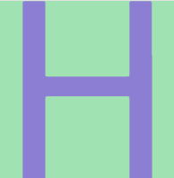

# Avatar Generator 头像生成器

[English](./README.MD) | 中文文档

## 中文文档

### 项目简介
这是一个基于Canvas的头像生成工具，支持React和Vue框架。可以根据输入的字符串生成独特的彩色头像。

### 功能特性
- 🎨 根据任意字符串生成彩色头像
- ⚛️ 提供React组件版本
- 🖖 提供Vue组件版本
- 🌀 支持圆形和方形两种样式
- 🎯 自动确保背景色和文字色的高对比度

### 安装使用

#### 安装
```bash
npm install @zenos-chen/avatar
```

#### React使用方式 
```jsx
import { Avatar} from '@zenos-chen/avatar';

function App() {
  return <Avatar str="H" height={200} />;
}
```



### React 圆形使用方式
```jsx
import { AvatarCircle } from '@zenos-chen/avatar';

function App() {
  return <AvatarCircle str="程" height={200} />;
}
```


#### Vue使用方式
```ts
<script setup>
import { AvatarVue } from '@zenos-chen/avatar/vue';
</script>

<template>
  <AvatarVue str="示例" :height="200" />
</template>
```

### 开发指南

#### 本地开发
```bash
npm run dev
```

#### 构建生产版本
```bash
npm run build
```

### 项目结构
```
avatar/
├── dist/            # 构建输出目录
├── playground/      # 开发测试环境
├── src/
│   ├── react/       # React组件实现
│   ├── vue/         # Vue组件实现
│   └── util/        # 核心工具函数
└── package.json
```

### 贡献指南
欢迎提交Pull Request或Issue报告问题。

---